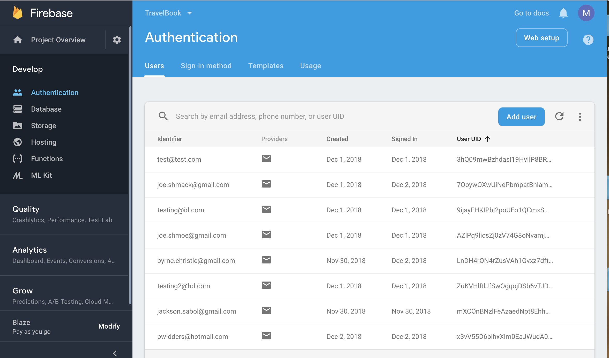
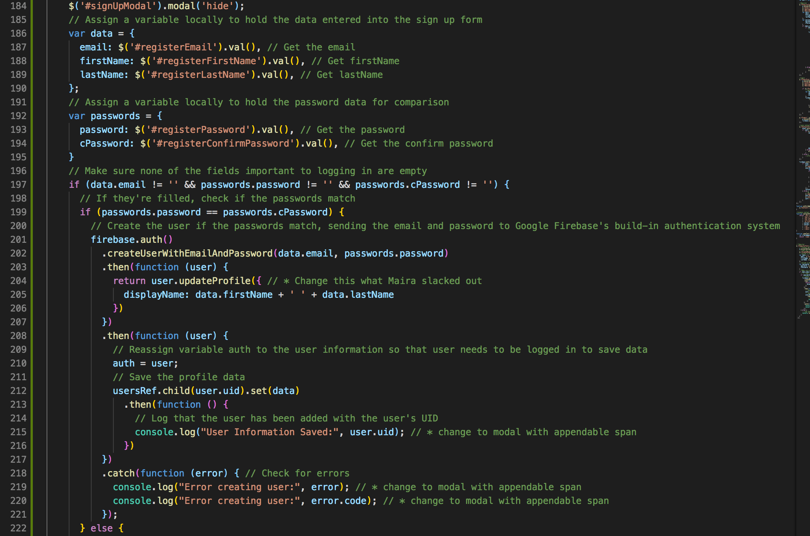
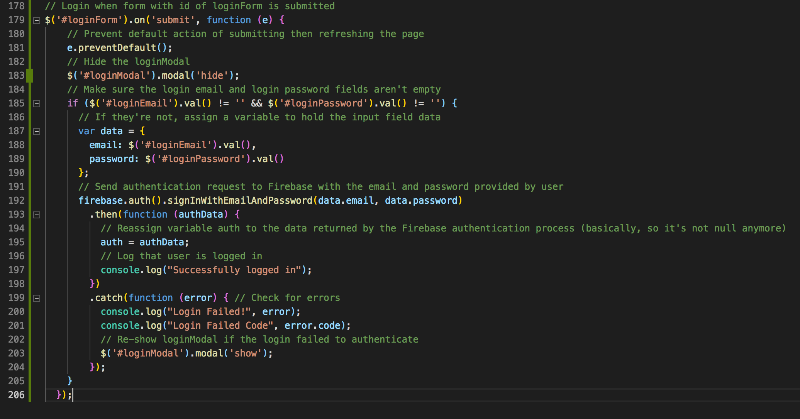
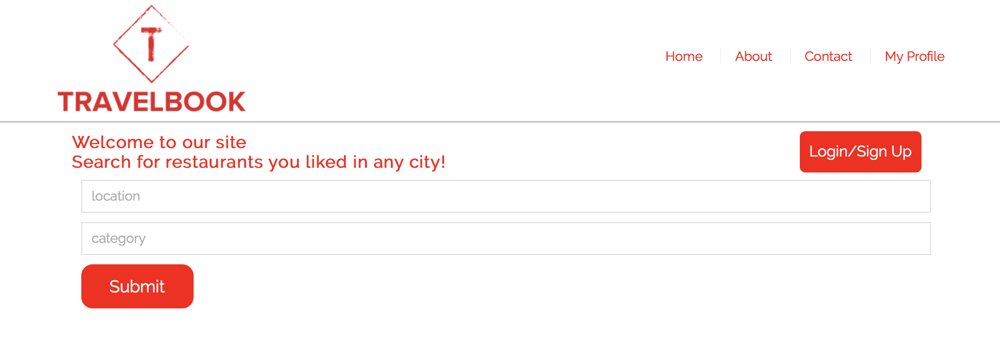
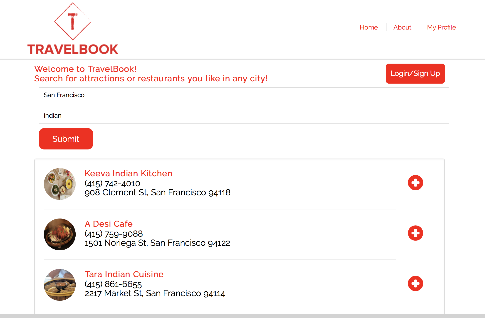

# Welcome to Travel Book!

## Project One

# Jackson Sabol, Christie Byrne, Pete Widders, Maira Jimenez

### Overview
 We employed HTML, CSS, JavaScript, Bootstrap, jQuery, JSON, Google Firebase and AJAX HTTP requests to generate the Travelbook app where users can create an account and build their own travel profile. Users are able to search and add their favorite restaurant/activities from cities they have previously visited to their profile page. Our overall concenpt and development of this app is that we believe when people travel to a new place they are more inclined to ask the opinion of someone they know such as a friend or family member for recommendations rather than asking online and reading a stranger's review. We believe there isn't a user-friendly platform at the moment where users are able to build a travel profile and share their travel recommendations with others. We think this app would also be a great personal tool for people who love to travel  to have a space and keep track of all the places they've visited and would want to re-visit. 

 ### Setting up firebase for Authentication/Registration
*Firebase

 ### Sign Up Functionality

Assigned two local variables to hold the data entered, first variable is var data which holds the users email, as well as their first and last name. Second we have var passwords, which holds the password they create and the password confirmation. Below we have two if statements, the first one makes sure all required fields are not left empty. The second if statement makes sure the new password created and the password confirmation match and if this is true it creates a new user. We also added the goggle log in functionality where users are able to log in using their gmail account. 

### Log In Authentication

When user wants to log in we send an authentication request to firebase to check if the email and password entered match any of our database. If yes, user is granted access to profile.

 ### To Research Restarurants and Location 
<ul>
 <li>Yelp API</li>
 <li>Google API</li>
</ul>

### Add Restarurants to Profile
When the plus button next to a restaurant is clicked, push this interest to Firebase database. 

Thank you for reading! 
### Link to Deployed Version

[https://jacksonsabol.github.io/Project_One/]

### Built With:
* HTML
* CSS
* JavaScript
* jQuery Library for appending to HTML
* JSON
* Google Firebase
* Bootstrap(Mobile Responsive)
* User Input Validations

